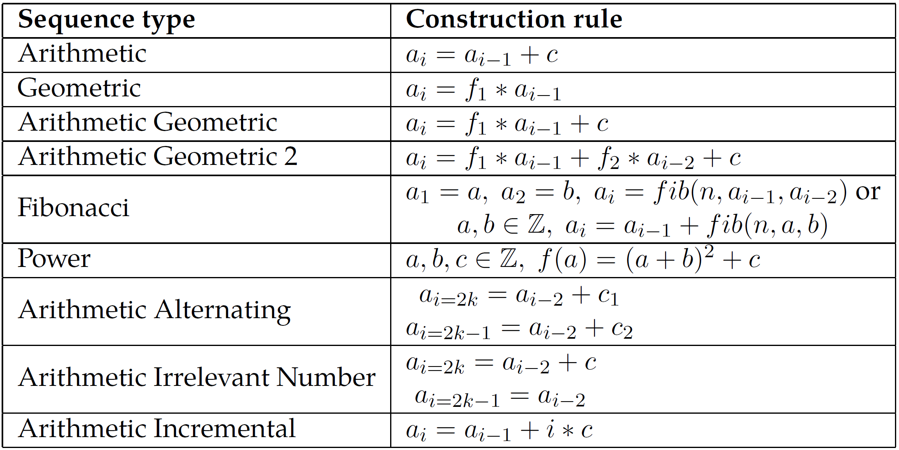

# IQ-Number-Test-Solver
This modular python package is an IQ-Number Test solver.
It significantly increases the performance of the SOTA (2020) on short IQ-Number Test sequences.
Additionally, it can solve for any position of a given IQ-Number Test sequence in contrast to only the last position.
Please have a look at my [Lab report](Lab_Report__MA_INF_4306_Solving_IQ_Number_Tests-1.pdf), if you are interested in a more detailed presentation of my results.

*This table shows the precision of the considered algorithms for completing series of length 7 correctly (6 positions given, one to fill).
The results are grouped by algorithm (named after the group designing it) and the sequence type contained in the test-set.
My algorithm is shown as "Scharr".
The results for the other algorithms are from [this benchmark](https://docs.google.com/spreadsheets/d/1NY_ty8dWDzet3DcqKVGQVRHnx7_T97Cotjfbeiu2IHc/edit#gid=0) by Maximilian Kernbach.*

|Test Set | Siebers and Schmid | Wolfram Alpha | OEIS | Scharr (my results)|
|:-----|:-----:|:-----:|:-----:|:-----:|
|Arithmetic | **100.0 \%** |  98.0 \% |  50.1 \% | **100.0 \%** |
|Geometric | **100.0 \%** | **100.0 \%** |  19.5 \% | **100.0 \%** |
|Arithmetic Geometric |  96.5 \% | **100.0 \%** |  29.1 \% | **100.0 \%** |
|Arithmetic Geometric 2 |  10.0 \% |  15.0 \% |   4.5 \% |  **42.9 \%** |
|Fibonacci |   0.0 \% |  51.5 \% |  13.4 \% | **100.0 \%** |
|Arithmetic Alternating |   3.4 \% |  11.0 \% |   0.1 \% | **100.0 \%** |
|Arithmetic \& Irrelevant |   0.0 \% |   0.0 \% |   0.3 \% | **100.0 \%** |
|Arithmetic Incremental | **100.0 \%** |  98.0 \% |   6.8 \% | **100.0 \%** |

<figure>
  

    
    <figcaption>Fig.1: A listing of the sequence types and their construction rules, generated in the same Lab by Maximilian Kernbach.</figcaption>
  

</figure>

To alter the tests made in the search structure, please add tests to the ..._test.py files.
Testingground.ipyn should give an overfiew over my project.
